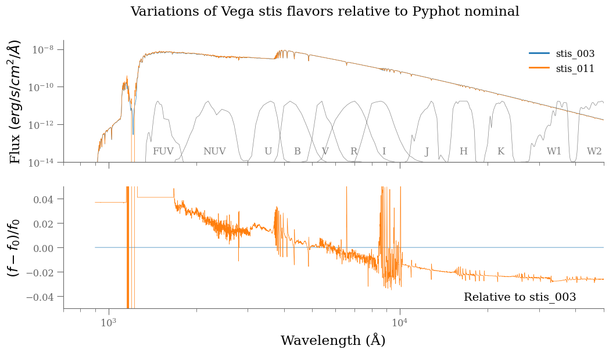

Details on the internal Vega reference spectra
==============================================

Vega (aka :math:`\alpha` Lyrae, HD 172167) serves as the fundamental calibration
standard for stellar photometry due to its exceptional brightness, and favorable
observational characteristics.  It is the fifth brightest star in the sky, after
Sirius, Canopus, Alpha Centauri and Arcturus and the second brightest star in
the northern celestial hemisphere.
As a nearby A0V star located approximately 25 light-years from Earth, Vega was
historically chosen as the primary standard because of its position near the
north celestial pole, making it easily accessible to northern hemisphere
observatories year-round (`Johnson & Morgan 1953
<https://ui.adsabs.harvard.edu/abs/1953ApJ...117..313J>`_).

Vega is a Delta Scuti variable star (dwarf Cepheids), one whose variations in
luminosity result from both radial and non-radial pulsations of its surface.
Some parts of its surface contract while others simultaneously expand
(non-radial pulsations), and the star also contracts and expands by changing its
radius to maintain its spherical shape (radial pulsations).

Delta Scuti variables are commonly used as standard candles to establish
distances because of their relatively flat spectral energy distribution across
optical wavelengths and "stability" over decades make it an ideal
reference for establishing magnitude zero-points across multiple filter systems
(`Oke & Gunn 1983 <https://ui.adsabs.harvard.edu/abs/1983ApJ...266..713O>`_).

However, the fact that Vega is actually a variable star with small but
measurable brightness variations has led the astronomical community to adopt
more stable references. The International Astronomical Union (IAU) and major
observatories now commonly use synthetic standards based on theoretical stellar
atmosphere models or carefully selected ensembles of stable stars. These
synthetic standards provide consistent, reproducible reference points that are
not subject to the intrinsic variability observed in individual stars like Vega,
ensuring long-term stability in photometric calibrations across different
observatories and epochs.

Modern space-based observations have refined Vega's spectral energy distribution
to unprecedented precision, with the CALSPEC database providing the definitive
reference spectrum used by HST and other major observatories (`Bohlin et al.
2014 <https://ui.adsabs.harvard.edu/abs/2014PASP..126..711B>`_). Despite the
discovery of Vega's infrared excess due to a circumstellar debris disk and minor
photometric variability, it remains the cornerstone of photometric systems, with
the AB magnitude system providing an alternative that maintains compatibility
while addressing some of Vega's limitations (`Fukugita et al. 1996
<https://ui.adsabs.harvard.edu/abs/1996AJ....111.1748F>`_).

Vega Flavors
------------

.. important::

    Since version 1.7.0, Pyphot includes a set of Vega flavors one can use transparently as photometric standards.

    * Pyphot provides `alpha_stis_003` (aliased to `legacy`) as the default Vega flavor (and only one before version 1.7.0). This flavor is also the reference for the values provided in the documentation.
    * (since version 1.7.0) Pyphot provides also `alpha_lyr_mod_003`, `alpha_lyr_mod_004`, and `alpha_stis_011` as alternative Vega flavors.
    * in a future release, Pyphot will switch the default Vega flavor to `alpha_stis_011` which is a more recent model that incorporates updated NLTE models and provides a more accurate representation of Vega's spectral energy distribution, particularly in the ultraviolet and optical ranges.

    Impact of Vega Flavors on zeropoints provided by Pyphot:

    * Changes in temperature will introduce a wavelength dependent shift in the vega zero points.
    * Changes in logg, metallicity, turbulence will introduce non trivial variations in the vega zero points.

`CALSPEC
<https://www.stsci.edu/hst/instrumentation/reference-data-for-calibration-and-tools/astronomical-catalogs/calspec>`_
provides a collection of composite stellar spectra that are flux standards for
the calibration of systems such as HST. In particular, it compiles many flavors
of Vega of which we summarize the most relevant ones below:

* `alpha_lyr_004` from `Bohlin, Colina, & Finley (1995) <https://ui.adsabs.harvard.edu/abs/1995AJ....110.1316B>`_. It corrsponds to pure hydrogen white dwarf models are the absolute flux standards.
* `alpha_lyr_005` from Colina, Bohlin & Castelli (1996), Instrument Science Report (`OSG-CAL-96-01 <https://www.stsci.edu/instruments/observatory/PDF/scs8.rev.pdf>`_). It corresponds to the combination of ultraviolet covered by average IUE spectrum; Optical up to 1.05 microns covered by Hayes (1985) average spectrum (IAU Symp 111, p 225); near-infrared covered by ATLAS12 based model computed by Dr. Castelli, rebinned to 25A, and normalized to Hayes (1985) Johnson V flux. V filter as in Buser & Kurucz 1979, AA 70, 555. (All wavelengths are vacuum.)
* `alpha_lyr_stis_003` (legacy) from `Bohlin (2007) <https://ui.adsabs.harvard.edu/abs/2007ASPC..364..315B>`_ a special model from Kurucz 9400K Vega spectrum T/g=9400/3.9 [M/H]=-0.5 fit against STIS data with microturbulence of 0. km/s, and where V = 0.023 mag.
* `alpha_lyr_mod_001` from `Bohlin (2014) <https://ui.adsabs.harvard.edu/abs/2014AJ....147..127B>`_ Special Model from Kurucz 9400K Vega spectrum T/g=9400/3.9 [M/H]=-0.5 at R=500 which reconciles visible and IR absolute flux, and where Vega Flux(5556A)=3.44e-9
* `alpha_lyr_mod_002` is identical to `alpha_mod_001` but normalized to STIS flux at 5545-5570A, corresponding to a scaled flux by 0.994242.
* `alpha_lyr_mod_003` is a different temperature, logg using Kurucz 9550K Vega spectrum T/g=9550/3.95 [M/H]=-0.5 at R=500 and normalized to Flux(5556A) = 3.44e-9 (over 5545-5570A).
* `alpha_lyr_mod_004` from `Bohlin, Hubeny, Rauch (2020) <https://ui.adsabs.harvard.edu/abs/2020AJ....160...21B>`_ is similar to `alpha_mod_003` but with a Flux(5556A)=3.47e-9. In the details, it also includes additional lines.
* `alpha_lyr_stis_011` is a special model from Bohlin which is a composite flux of a special Kurucz 9550K model from 900-1152A (Kurucz 2003), IUE data from 1152-1675A, STIS CCD fluxes from 1675-10200A (Bohlin & Gilliland 2004a), and the 9550K model longward of 10200A. It differs significantly in the uv-optical range by accounting for the new TMAP AND TLUSTY WD NLTE models (`Bohlin, Hubeny, Rauch (2020) <https://ui.adsabs.harvard.edu/abs/2020AJ....160...21B>`_) but corresponds to `alpha_mod_004` above 1 micron.

The figure below shows the differences between the various Vega flavors
available in Pyphot. The top panel shows the absolute fluxes, while the bottom
panel shows the relative differences with respect to the `alpha_stis_003` (the
legacy Pyphot reference flavor).  flavor.

.. figure:: vega_flavors_comparison.png
   :align: center
   :scale: 70 %

   **Figure:**  Variations of Vega Flavors relative to Pyphot legacy reference flavor (`alpha_stis_003`).
   The differences between the various flavors could be significant, particularly in the ultraviolet. These result from stellar template parameter changes (e.g. temperature), the reference atmospheres (e.g. LTE, NLTE) and specific calibration details.

.. dropdown:: Figure source code

    .. code-block:: python

        import numpy as np
        import matplotlib.pyplot as plt
        from pyphot import Vega

        def plot_vega_comparison(which):
            _, axes = plt.subplots(2, 1, figsize=(12, 6), sharex=True)

            # Use the first as reference
            with Vega(flavor=which[0]) as vega:
                vega_reference = vega

            # Plot each flavor and the relative difference to the reference
            for flavor in which:
                with Vega(flavor=flavor) as vega:
                    axes[0].loglog(
                        vega.wavelength.magnitude, vega.flux.magnitude, label=flavor, lw=0.5
                    )  # type: ignore
                    fref = np.interp(
                        vega.wavelength.magnitude,
                        vega_reference.wavelength.magnitude,
                        vega_reference.flux.magnitude,
                    )  # type: ignore
                    axes[1].plot(
                        vega.wavelength.magnitude,
                        (vega.flux.magnitude - fref) / fref,
                        label=flavor,
                        lw=0.5,
                    )  # type: ignore

            # polish
            axes[1].set_ylim(-0.20, 0.20)
            axes[0].set_ylim(1e-14, 3e-8)
            axes[0].set_ylabel(r"Flux $(erg/s/cm^2/Å)$")
            axes[1].set_ylabel(r"$(f - f_0) / f_0$")
            axes[1].text(
                0.95,
                0.05,
                f"Relative to {which[0]}",
                transform=axes[1].transAxes,
                ha="right",
                va="bottom",
            )
            axes[1].set_xlabel("Wavelength (Å)")
            axes[0].set_xlim(700, 50_000)
            lg = axes[0].legend(loc="best", fontsize="small", frameon=False)
            plt.setp(lg.get_lines(), lw=2);

        which = ["stis_003", "mod_002", "mod_003", "mod_004", "stis_011"]
        plot_vega_comparison(which)
        plt.suptitle("Variations of Vega Flavors relative to Pyphot nominal", fontsize="large")

The following figure compares the `alpha_stis_003` and `alpha_stis_011` flavors,
which are the two most commonly used Vega flavors in Pyphot. The
`alpha_stis_011` flavor is a more recent model that incorporates updated NLTE
models and provides a more accurate representation of Vega's spectral energy
distribution, particularly in the ultraviolet and optical ranges.

   **Figure:** Variations of Vega STIS Flavors. The variations are of the order of 5% in the optical, primarily induced by the update in temperature.

.. dropdown:: Figure source code

    .. code-block:: python

        from pyphot import svo

        # filters to add for reference
        pbs = [
            svo.get_pyphot_filter(name)
            for name in [
                "GALEX/GALEX.FUV", "GALEX/GALEX.NUV",
                "Generic/Johnson.U", "Generic/Johnson.B", "Generic/Johnson.V", "Generic/Johnson.R", "Generic/Johnson.I",
                "Generic/Bessell_JHKLM.J", "Generic/Bessell_JHKLM.H", "Generic/Bessell_JHKLM.K",
                "WISE/WISE.W1", "WISE/WISE.W2",
            ]
        ]

        which = ["stis_003", "stis_011"]
        plot_vega_comparison(which)
        plt.suptitle(
            "Variations of Vega stis flavors relative to Pyphot nominal", fontsize="large"
        )
        axes = plt.gcf().get_axes()

        # add passbands
        ax1 = plt.twinx(axes[0])
        for p in pbs:
            ax1.plot(
                p.wavelength.to("AA").magnitude,
                p.transmit / p.transmit.max(),
                label=p.name, lw=0.5, color="0.5",
            )
            ax1.text(
                p.cl.to("AA").magnitude,
                0.1,
                p.name.split(".")[-1],
                ha="center", va="bottom", fontsize="small", color="0.5",
            )

        ax1.set_ylim(0, 2.0)
        plt.setp([ax1.get_yticklabels(), ax1.get_yticklines()], visible=False)

.. note::

    We note that `alpha_stis_011` seems to be corrupt around 1200 Å which has no impact of currently existing passbands.

Example Vega Flavors Usage
----------------------------

To use a specific Vega flavor for the photometric calculations in Pyphot, you can set the `vega` keyword parameter  when creating a passband or use the `set_vega_flavor` method to update it.
For example, to use the `alpha_stis_011` flavor when creating a passband filter, you can do the following:

.. code-block:: python

    from pyphot.astropy import UnitFilter, Unit as u

    # Create a passband using the Vega flavor
    pb = UnitFilter(
        [4000, 5000, 6000] * u.AA,
        [0.1, 0.8, 0.1],
        name="Example Passband",
        dtype="photon"
        vega="stis_011"  # Specify the Vega flavor,
    )

Or alternatively, you can set/reset the Vega flavor after:

.. code-block:: python

    from pyphot import svo

    pb = svo.get_pyphot_filter("GALEX/GALEX.FUV")
    # Set the Vega flavor to use
    pb.set_vega_flavor("stis_011")

References
----------

.. custom ADS format: %l, %Y, %q, %V, %p, "%T", `%R <%u>`_

* Bohlin, R. C., Colina, L., & Finley, D. S., 1995, AJ, 110, 1316, "White Dwarf Standard Stars: G191-B2B, GD 71, GD 153, HZ 43", `1995AJ....110.1316B <https://ui.adsabs.harvard.edu/abs/1995AJ....110.1316B>`_
* Bohlin, R. C., 2007, ASPC, 364, 315, "HST Stellar Standards with 1% Accuracy in Absolute Flux", `2007ASPC..364..315B <https://ui.adsabs.harvard.edu/abs/2007ASPC..364..315B>`_
* Bohlin, R. C., 2014, AJ, 147, 127, "Hubble Space Telescope CALSPEC Flux Standards: Sirius (and Vega)", `2014AJ....147..127B <https://ui.adsabs.harvard.edu/abs/2014AJ....147..127B>`_
* Bohlin, R. C., Gordon, K. D., & Tremblay, P.-E., 2014, PASP, 126, 711, "Techniques and Review of Absolute Flux Calibration from the Ultraviolet to the Mid-Infrared", `2014PASP..126..711B <https://ui.adsabs.harvard.edu/abs/2014PASP..126..711B>`_
* Bohlin, R. C., Hubeny, I., & Rauch, T., 2020, AJ, 160, 21, "New Grids of Pure-hydrogen White Dwarf NLTE Model Atmospheres and the HST/STIS Flux Calibration", `2020AJ....160...21B <https://ui.adsabs.harvard.edu/abs/2020AJ....160...21B>`_
* Colina, Bohlin & Castelli 1996, Instrument Science Report, "Absolute Flux Calibrated Spectrum of Vega" `OSG-CAL-96-01 <https://www.stsci.edu/instruments/observatory/PDF/scs8.rev.pdf>`_
* Fukugita, M., Ichikawa, T., Gunn, J. E., Doi, M., Shimasaku, K., & Schneider, D. P., 1996, AJ, 111, 1748, "The Sloan Digital Sky Survey Photometric System", `1996AJ....111.1748F <https://ui.adsabs.harvard.edu/abs/1996AJ....111.1748F>`_
* Johnson, H. L. \& Morgan, W. W. 1953, ApJ, 117, 313, "Fundamental stellar photometry for standards of spectral type on the Revised System of the Yerkes Spectral Atlas." `1953ApJ...117..313J <https://ui.adsabs.harvard.edu/abs/1953ApJ...117..313J>`_;
* Oke, J. B. and Gunn, J. E., 1983, ApJ, 266, 713, "Secondary standard stars for absolute spectrophotometry.”  `1983ApJ...266..713O <https://ui.adsabs.harvard.edu/abs/1983ApJ...266..713O>`_;
